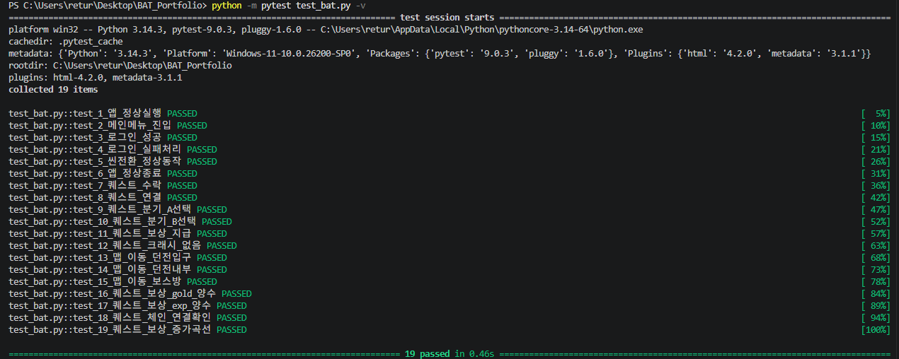
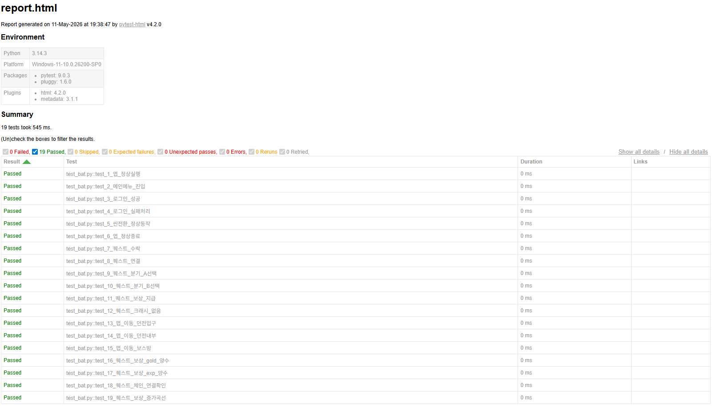
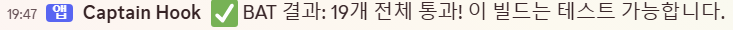

# 🎮 게임 BAT 자동화 포트폴리오


## 만들게 된 이유
게임 QA로 일하면서 신규 빌드가 나올 때마다 BAT(Build Acceptance Test)를
수작업으로 반복하는 것이 비효율적이라고 느끼게되어 만들게 되었습니다.

특히 빌드가 자주 나오는 환경에서는 매번 동일한 체크리스트를 수동으로
확인하는 데 많은 시간이 소요됐습니다.

또한 퀘스트 기능을 수동으로 확인하는 데 굉장히 많은 시간이 소요되어 해당 테스트도 자동화 하게 되면 QA 팀이 더 중요한 탐색적 테스트에 집중할 수 있다고 판단해 이 프로젝트를 만들었습니다.

기존에는 빌드마다 BAT 수작업 체크에 30분~1시간이 소요됐으나, 자동화 후 명령어 하나로 테스트를 일괄 실행할 수 있는 구조로 개선했습니다.

## 자동화 내용
- **BAT 테스트**: 앱 실행, 메인메뉴 진입, 로그인, 씬 전환, 정상 종료
- **퀘스트 기능 테스트**: 수락, 연결, 분기, 보상 지급, 크래시 여부, 맵 이동
- **CSV 기반 데이터 검증**: 기획 데이터를 자동으로 읽어 보상 수치 및 퀘스트 체인 검증
- **디스코드 자동 알림**: 테스트 완료 시 결과를 디스코드 채널로 자동 전송
- **HTML 리포트 자동 생성**: 테스트 결과를 시각적으로 확인 가능

## 실행 결과

### 터미널 테스트 결과


### HTML 리포트


### 디스코드 자동 알림


## 실행 방법

### 설치
```bash
pip install pytest pytest-html requests python-dotenv
```

### 환경 설정
`.env` 파일 생성 후 디스코드 웹훅 URL 입력
DISCORD_WEBHOOK_URL=your_webhook_url

### 테스트 실행
```bash
python -m pytest test_bat.py -v --html=report.html --self-contained-html
```

## 기술 스택
- Python
- pytest / pytest-html
- Discord Webhook
- CSV 데이터 파싱

## 파일 구조
```
BAT_Portfolio/
├── test_bat.py       # 19개 테스트 케이스
├── quest_data.csv    # 퀘스트 기획 데이터
├── conftest.py       # 디스코드 알림
└── README.md
```